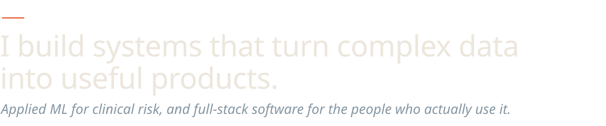
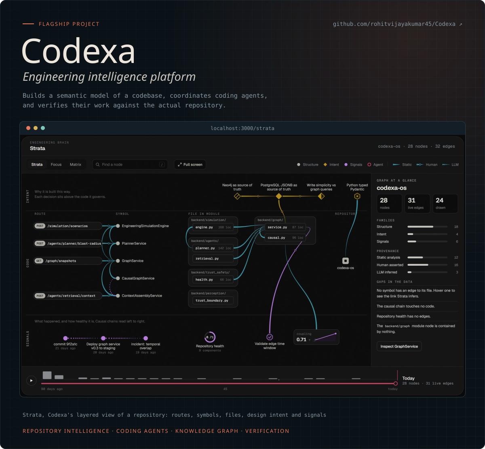
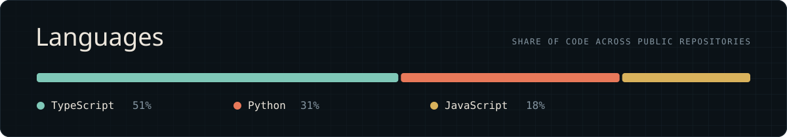
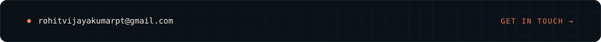

  

<picture>
  <source media="(prefers-color-scheme: light)" srcset="assets/thesis-light.svg" />
  
</picture>

On the ML side I work on healthcare: predicting clinical risk from ICU data and segmenting medical images, with the evaluation and explainability a model needs before anyone relies on it. On the engineering side I build complete products, from AI developer tools to real-time web apps.

 
 

<picture>
  <source media="(prefers-color-scheme: light)" srcset="assets/section-work-light.svg" />
  
</picture>

<table>
<tr>
<td width="33%" valign="top">

#### [AEGIS](https://github.com/rohitvijayakumar45/AEGIS-Acoustic-physiologic-Early-Guard-for-ICU-Swallow-dysfunction.)
Early warning for swallowing dysfunction in ICU patients, from MIMIC-IV physiology and acoustic features. Calibrated, fairness-checked, explained with SHAP, and tested on external datasets.

`Python` `PyTorch` `SHAP`

</td>
<td width="33%" valign="top">

#### [GallScan AI](https://github.com/rohitvijayakumar45/Gallstone_Detection_Model)
Gallstone detection in ultrasound with YOLO26 instance segmentation, served over an API with EigenCAM heatmaps and a prediction-stability map.

`Python` `YOLO` `FastAPI`

</td>
<td width="33%" valign="top">

#### [Smart AI Proctoring](https://github.com/rohitvijayakumar45/Exam-Proctoring)
Exam proctoring in the browser: face detection, automated violation logging and a live dashboard for invigilators.

`TypeScript` `React` `MongoDB`

</td>
</tr>
</table>

 

<picture>
  <source media="(prefers-color-scheme: light)" srcset="assets/section-more-light.svg" />
  
</picture>

**[Auralis](https://github.com/rohitvijayakumar45/Auralis)** · `TypeScript` `React` `AWS`\
A private cloud photo library: presigned uploads to S3, Lambda-generated thumbnails, Cognito sign-in, and albums in MySQL.

**[BarbellHub](https://github.com/rohitvijayakumar45/BarbellHub)** · `JavaScript` `React` `LLM`\
An AI coach for the self-hosted [openGym](https://github.com/DuarteSantos8/openGym) tracker that designs a training plan and revises it from the workouts you actually log.

**[FitQuest](https://github.com/rohitvijayakumar45/FitQuest)** · `React` `Express` `PostgreSQL`\
Fitness and diet tracker with workout logging, meal planning, progress analytics and streaks.

 

<picture>
  <source media="(prefers-color-scheme: light)" srcset="assets/section-toolbox-light.svg" />
  
</picture>

  
   
  

 

<picture>
  <source media="(prefers-color-scheme: light)" srcset="assets/section-activity-light.svg" />
  
</picture>

<picture>
  <source media="(prefers-color-scheme: dark)" srcset="https://raw.githubusercontent.com/rohitvijayakumar45/rohitvijayakumar45/output/snake-dark.svg" />
  <source media="(prefers-color-scheme: light)" srcset="https://raw.githubusercontent.com/rohitvijayakumar45/rohitvijayakumar45/output/snake.svg" />
  
</picture>

 

